# gitflow-practice
# gitflow-practice
GitFlow를 검색하면 자주 접하게 되는 유명한 이미지인데, 여기에 나온 흐름을 직접 똑같이 따라 해보자.  
(이미지 출처 : https://nvie.com/posts/a-successful-git-branching-model/)  
  

처음 깃허브 프로젝트를 생성하면 main 브랜치 하나밖에 없다.  

    $ git branch -a

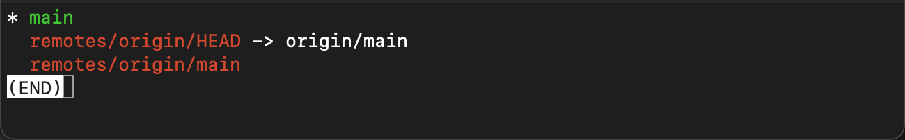  

파일을 하나 생성한다.  

    $ echo 'Hello Gitflow' > app.txt  
    $ cat app.txt

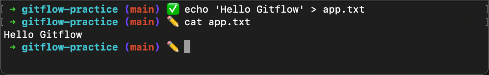  

커밋 후 v0.1 태그  

    $ git add app.txt  
    $ git commit -m "first commit"  
    $ git tag v0.1  
    $ git log  

  

develop 브랜치 생성 후 체크아웃  

    $ git checkout -b develop  
    $ git branch  

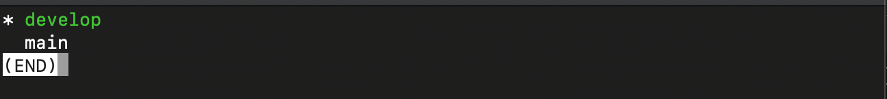  

develop 브랜치 작업  

    $ echo 'Dev' >> app.txt  
    $ git add .  
    $ git commit -m "dev 0"  
    $ sed -i '' 's/Dev/Dev1/g' app.txt  
    $ git add .  
    $ git commit -m "dev 1"  
    $ sed -i '' 's/Dev1/Dev2/g' app.txt
    $ git add .
    $ git commit -m "dev 2" 
    $ cat app.txt  

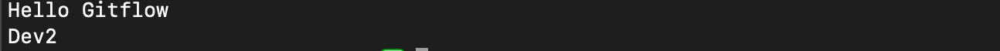  

feature/future 브랜치 작업 시작  

    $ git checkout -b feature/future  
    $ echo 'working..' > future.txt  
    $ git add .  
    $ git commit -m "future 0" 
    $ cat future.txt       

  

feature/next 브랜치 작업 시작  

    $ git checkout -b feature/next develop  
    $ echo 'coding..' > next.txt  
    $ cat next.txt  
    $ git add .  
    $ git commit -m "next 0"  
    $ cat next.txt  

  

develop 브랜치 작업 

    $ git checkout develop
    $ sed -i '' 's/Dev2/Dev3/g' app.txt  
    $ git add .  
    $ git commit -m "dev 3"   

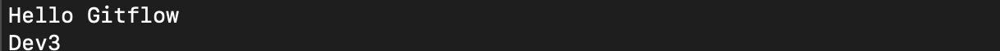  

main 브랜치 hotfix 작업

    $ git checkout -b hotfix main  
    $ echo 'Hotfix' >> app.txt  
    $ git add .
    $ git commit -m "hotfix"  
    $ cat app.txt  

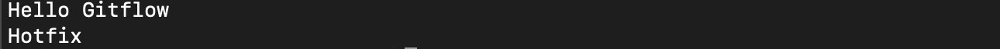  

hotfix 브랜치를 main 브랜치에 fastforward merge 하고 v0.2 태그  

    $ git checkout main  
    $ git merge --ff-only hotfix 
    $ git tag v0.2
    $ cat app.txt  

  

hotfix 브랜치를 develop 브랜치에 3way merge  

    $ git checkout develop  
    $ git merge --no-ff hotfix  
    
conflict 발생  
  

conflict 해결  

    $ git mergetool -t opendiff  
    $ git rm app.txt.orig  
    $ git commit -m "merge hotfix"  

  

다시 feature/next 브랜치 작업   

    $ git checkout feature/next  
    $ echo 'coding...' >> next.txt  
    $ git add .  
    $ git commit -m "next 1"  
    $ echo 'coding....' >> next.txt  
    $ git add .  
    $ git commit -m "next 2"  
    $ cat next.txt  

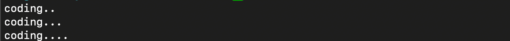   

feature/next 브랜치를 develop 브랜치에 3way merge  

    $ git checkout develop  
    $ git merge --no-ff feature/next  
    $ ls  

   

release 브랜치 생성  

    $ git checkout -b release develop  

release 브랜치 버그 수정  

    $ echo 'bugfix' >> next.txt  
    $ git add .  
    $ git commit -m "bugfix next.txt"  
    $ cat next.txt  

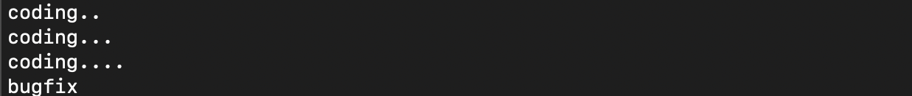   

release 브랜치를 develop 브랜치에 3way merge  

    $ git checkout develop  
    $ git merge --no-ff release  

feature/next 브랜치 추가 작업 시작   

    $ git checkout feature/next  
    $ git rebase develop  
    $ echo 'coding!' >> next.txt  
    $ git add .  
    $ git commit -m "next 3"  
    $ echo 'coding!!' >> next.txt  
    $ git add .  
    $ git commit -m "next 4"  
    $ echo 'coding!!!' >> next.txt  
    $ git add .  
    $ git commit -m "next 5"  
    $ cat next.txt  

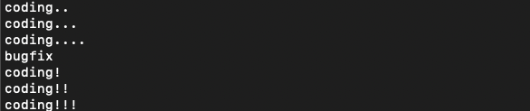   

release 브랜치 버그 수정  

    $ git checkout release  
    $ echo 'Bugfix' >> app.txt  
    $ git add .  
    $ git commit -m "bugfix app.txt"   
    $ echo 'bugfix' >> next.txt   
    $ git add .  
    $ git commit -m "bugfix next.txt"  
    $ cat <(echo '-- app.txt --') app.txt <(echo '-- next.txt --') next.txt  

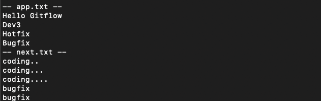   

release 브랜치를 main 브랜치에 fastforward merge 하고 v1.0 태그  

    $ git checkout main  
    $ git merge --ff-only release  
    $ git tag v1.0  

release 브랜치를 develop 브랜치에 3way merge  

    $ git checkout develop  
    $ git merge --no-ff release  

feature/next 브랜치를 develop 브랜치에 3way merge  

    $ git checkout develop  
    $ git merge --no-ff feature/next  

conflict 발생   

    $ git status  

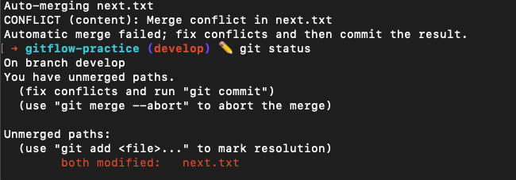   

conflict 해결  

    $ git mergetool -t opendiff  
    $ rm next.txt.orig  
    $ git commit -m "merge feature/next"  

   

feature/future 브랜치 작업  

    $ git checkout feature/future  
    $ echo 'working...' >> future.txt  
    $ git add .  
    $ git commit -m "future 1"  
    $ echo 'working....' >> future.txt  
    $ git add .  
    $ git commit -m "future 2"  
    $ echo 'working....' >> future.txt  
    $ git add .  
    $ git commit -m "future 3"  
    $ cat future.txt  
    
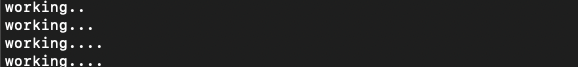   

feature/future 브랜치를 develop 브랜치에 3way merge  

    $ git checkout develop  
    $ git merge --no-ff feature/future  

develop 브랜치를 release 브랜치에 fastforward merge  

    $ git checkout release  
    $ git merge --ff-only develop  

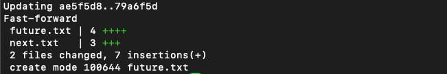   

release 브랜치를 main 브랜치에 fastforward merge 하고 v1.1 태그  

    $ git checkout main  
    $ git merge --ff-only release  
    $ git tag v1.1    

위에 설명 이미지와 비교😀  

    $ git log --graph --oneline  

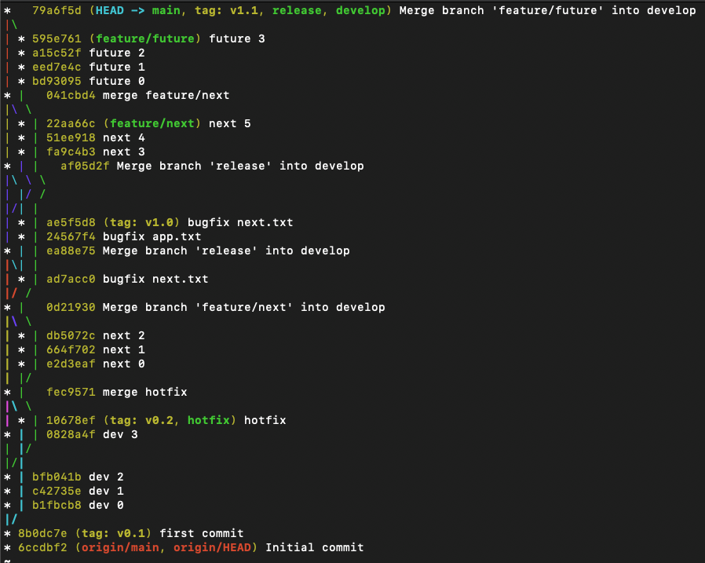   