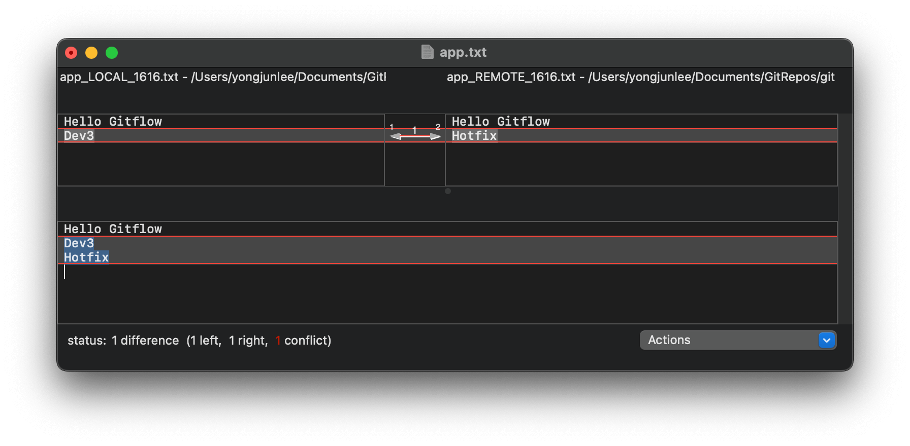
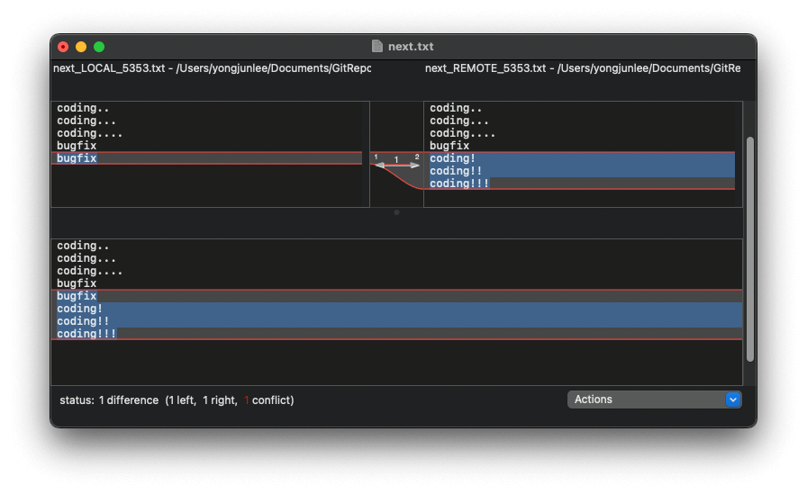

# gitflow-practice
GitFlow를 검색하면 자주 접하게 되는 유명한 이미지인데, 여기에 나온 흐름을 직접 똑같이 따라 해보자.  
(이미지 출처 : https://nvie.com/posts/a-successful-git-branching-model/)  
  

처음 깃허브 프로젝트를 생성하면 main 브랜치 하나밖에 없다.  

    $ git branch -a
```bash
* main
  remotes/origin/HEAD -> origin/main
  remotes/origin/main
```
파일을 하나 생성한다.  

    $ echo 'Hello Gitflow' > app.txt  
    $ cat app.txt
```bash
Hello Gitflow
```

커밋 후 v0.1 태그  

    $ git add app.txt  
    $ git commit -m "first commit"  
    $ git tag v0.1  
    $ git log  

```bash
commit HASHKEY (HEAD -> main, tag: v0.1)
Author: yyyongdev
Date Fri Sep 30 21:46:28 2022 +0900

    first commit
```

develop 브랜치 생성 후 체크아웃  

    $ git checkout -b develop  
    $ git branch  

```bash
* develop
  main
```

develop 브랜치 작업  

    $ echo 'Dev' >> app.txt  
    $ git add .  
    $ git commit -m "dev 0"  
    $ sed -i '' 's/Dev/Dev1/g' app.txt  
    $ git add .  
    $ git commit -m "dev 1"  
    $ sed -i '' 's/Dev1/Dev2/g' app.txt
    $ git add .
    $ git commit -m "dev 2" 
    $ cat app.txt  

```bash
Hello Gitflow
Dev2
```

feature/future 브랜치 작업 시작  

    $ git checkout -b feature/future  
    $ echo 'working..' > future.txt  
    $ git add .  
    $ git commit -m "future 0" 
    $ cat future.txt       

```bash
working..
```

feature/next 브랜치 작업 시작  

    $ git checkout -b feature/next develop  
    $ echo 'coding..' > next.txt  
    $ cat next.txt  
    $ git add .  
    $ git commit -m "next 0"  
    $ cat next.txt  

```bash
coding..
```

develop 브랜치 작업 

    $ git checkout develop
    $ sed -i '' 's/Dev2/Dev3/g' app.txt  
    $ git add .  
    $ git commit -m "dev 3"   

```bash
Hello Gitflow
Dev3
```

main 브랜치 hotfix 작업

    $ git checkout -b hotfix main  
    $ echo 'Hotfix' >> app.txt  
    $ git add .
    $ git commit -m "hotfix"  
    $ cat app.txt  

```bash
Hello Gitflow
Hotfix
```

hotfix 브랜치를 main 브랜치에 fastforward merge 하고 v0.2 태그  

    $ git checkout main  
    $ git merge --ff-only hotfix 
    $ git tag v0.2
    $ cat app.txt  

```bash
Hello Gitflow
Hotfix
```

hotfix 브랜치를 develop 브랜치에 3way merge  

    $ git checkout develop  
    $ git merge --no-ff hotfix  
    
app.txt conflict이 발생 
```bash
Auto-merging app.txt
CONFLICT (content): Merge conflict in app.txt
Automatic merge failed; fix conflicts and then commit the result.
```
conflct 확인

    $ cat app.txt

```bash
Hello Gitflow
<<<<<< HEAD
Hev3
======
Hotfix
>>>>>> hotfix
```

conflict 해결 (여기서는 opendiff 툴을 사용했지만 수동 or 익숙한 툴 사용하면 된다)

    $ git mergetool -t opendiff  
    $ git rm app.txt.orig  
    $ git commit -m "merge hotfix"  

  

다시 feature/next 브랜치 작업   

    $ git checkout feature/next  
    $ echo 'coding...' >> next.txt  
    $ git add .  
    $ git commit -m "next 1"  
    $ echo 'coding....' >> next.txt  
    $ git add .  
    $ git commit -m "next 2"  
    $ cat next.txt  

```bash
coding..
coding...
coding....
```

feature/next 브랜치를 develop 브랜치에 3way merge  

    $ git checkout develop  
    $ git merge --no-ff feature/next  
    $ ls  

```bash
README.md  app.txt  next.txt
```

release 브랜치 생성  

    $ git checkout -b release develop  

release 브랜치 버그 수정  

    $ echo 'bugfix' >> next.txt  
    $ git add .  
    $ git commit -m "bugfix next.txt"  
    $ cat next.txt  

```bash
coding..
coding...
coding....
bugfix
```

release 브랜치를 develop 브랜치에 3way merge  

    $ git checkout develop  
    $ git merge --no-ff release  

feature/next 브랜치 추가 작업 시작   

    $ git checkout feature/next  
    $ git rebase develop  
    $ echo 'coding!' >> next.txt  
    $ git add .  
    $ git commit -m "next 3"  
    $ echo 'coding!!' >> next.txt  
    $ git add .  
    $ git commit -m "next 4"  
    $ echo 'coding!!!' >> next.txt  
    $ git add .  
    $ git commit -m "next 5"  
    $ cat next.txt  

```bash
coding..
coding...
coding....
bugfix
coding!
coding!!
coding!!!
```

release 브랜치 버그 수정  

    $ git checkout release  
    $ echo 'Bugfix' >> app.txt  
    $ git add .  
    $ git commit -m "bugfix app.txt"   
    $ echo 'bugfix' >> next.txt   
    $ git add .  
    $ git commit -m "bugfix next.txt"  
    $ cat <(echo '-- app.txt --') app.txt <(echo '-- next.txt --') next.txt  

```bash
-- app.txt --
Hello Gitflow
Dev3
Hotfix
Bugfix
-- next.txt --
coding..
coding...
coding....
bugfix
bugfix
``` 

release 브랜치를 main 브랜치에 fastforward merge 하고 v1.0 태그  

    $ git checkout main  
    $ git merge --ff-only release  
    $ git tag v1.0  

release 브랜치를 develop 브랜치에 3way merge  

    $ git checkout develop  
    $ git merge --no-ff release  

feature/next 브랜치를 develop 브랜치에 3way merge  

    $ git checkout develop  
    $ git merge --no-ff feature/next  

next.txt conflict 발생   
```bash
Auto-merging next.txt
CONFLICT (content): Merge conflict in next.txt
Automatic merge failed; fix conflicts and then commit the result.
```

상태 확인
    
    $ git status  

```bash
On branch develop
You have unmerged paths.
    (fix conflicts and run "git commit")
    (use "git merge --abort" to abort the merge)

Unmerged paths:
    (use "git add <file>..." to mark resolution)
        both modified:  next.txt
```

conflict 해결  

    $ git mergetool -t opendiff  
    $ rm next.txt.orig  
    $ git commit -m "merge feature/next"  

   

feature/future 브랜치 작업  

    $ git checkout feature/future  
    $ echo 'working...' >> future.txt  
    $ git add .  
    $ git commit -m "future 1"  
    $ echo 'working....' >> future.txt  
    $ git add .  
    $ git commit -m "future 2"  
    $ echo 'working.....' >> future.txt  
    $ git add .  
    $ git commit -m "future 3"  
    $ cat future.txt  
    
```bash
working..
working...
working....
working.....
```

feature/future 브랜치를 develop 브랜치에 3way merge  

    $ git checkout develop  
    $ git merge --no-ff feature/future  

develop 브랜치를 release 브랜치에 fastforward merge  

    $ git checkout release  
    $ git merge --ff-only develop  

```bash
Updateing ae5f5d8..79a6f5d
Fast-forward
  future.txt | 4 ++++
  next.txt   | 3 +++
  2 files changed. 7 insertions(+)
```

release 브랜치를 main 브랜치에 fastforward merge 하고 v1.1 태그  

    $ git checkout main  
    $ git merge --ff-only release  
    $ git tag v1.1    

위에 설명 이미지와 비교😀  

    $ git log --graph --oneline  

```bash
*   79a6f5d (tag: v1.1, origin/release, origin/develop, release, develop) Merge branch 'feature/future' into develop
|\  
| * 595e761 (origin/feature/future, feature/future) future 3
| * a15c52f future 2
| * eed7e4c future 1
| * bd93095 future 0
* |   041cbd4 merge feature/next
|\ \  
| * | 22aa66c (origin/feature/next, feature/next) next 5
| * | 51ee918 next 4
| * | fa9c4b3 next 3
* | |   af05d2f Merge branch 'release' into develop
|\ \ \  
| |/ /  
|/| |   
| * | ae5f5d8 (tag: v1.0) bugfix next.txt
| * | 24567f4 bugfix app.txt
* | | ea88e75 Merge branch 'release' into develop
|\| | 
| * | ad7acc0 bugfix next.txt
|/ /  
* |   0d21930 Merge branch 'feature/next' into develop
|\ \  
| * | db5072c next 2
| * | 664f702 next 1
| * | e2d3eaf next 0
| |/  
* |   fec9571 merge hotfix
|\ \  
| * | 10678ef (tag: v0.2, origin/hotfix, hotfix) hotfix
* | | 0828a4f dev 3
| |/  
|/|   
* | bfb041b dev 2
* | c42735e dev 1
* | b1fbcb8 dev 0
|/  
* 8b0dc7e (tag: v0.1) first commit
* 6ccdbf2 Initial commit
```